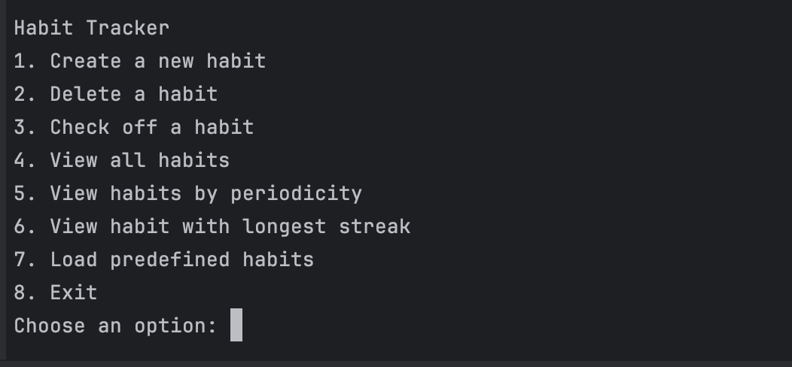
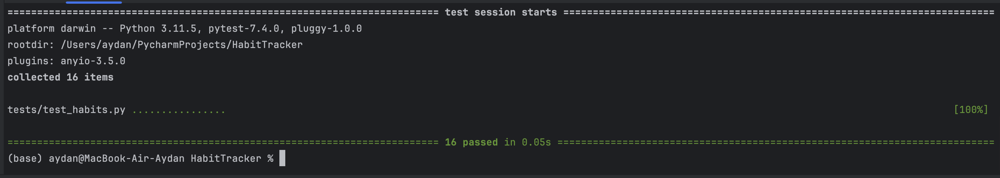

# Habit Tracker CLI Application

This project is a command-line Habit Tracker application developed in Python using Object-Oriented Programming principles. The application allows users to create, manage, and track habits, as well as analyze habit streaks over time.

This project was developed as part of the IU International University portfolio project for the module:

DLBDSOOFPP01 – Object-Oriented and Functional Programming with Python

---

## Project Highlights
- Modular Python application with clear separation of responsibilities
- Object-Oriented design using a custom Habit class
- Functional programming approach for analytics
- SQLite database for persistent storage
- Command-Line Interface (CLI) for user interaction
- Daily and weekly habit tracking
- Accurate streak calculation based on periodicity
- Predefined 4-week dataset for testing and validation
- Automated testing using pytest

---

## Features

- Create, edit, and delete habits  
- Track habit completion (daily or weekly)  
- Analyze habit streaks  
- View all habits  
- Filter habits by periodicity (daily or weekly)  
- Identify the habit with the longest streak  
- Load predefined habits with 4 weeks of test data  
- Persistent data storage using SQLite  
- Unit testing implemented with pytest 

---

## Technologies Used

- Python 3.11  
- SQLite (database storage)  
- pytest (unit testing)  
- Object-Oriented Programming (OOP)  
- Functional Programming (analytics module) 

---
## Project Structure

```
habit-tracker/
├── src/
│   ├── main.py        # CLI entry point
│   ├── habit.py       # Habit class and habit logic
│   ├── db.py          # Database management
│   └── analytics.py   # Habit analysis functions
│
├── tests/
│   └── test_habits.py # Unit tests
│
└── README.md
```


---

## How to Run the Application

## 1. Clone the repository:

```bash
git clone https://github.com/aydanh2005/habit-tracker.git
cd habit-tracker
```
## 2. Create and activate a virtual environment

```bash
python -m venv .venv
source .venv/bin/activate
```
## 3. Install Dependencies

```bash
pip install pytest
```
## Run the application:

```bash
python src/main.py
```
---

## Screenshots

### CLI Menu


### Pytest Results


## How to Use the Application

When the program starts, a menu appears in the terminal.

From the menu you can:

- Create a new habit
- Delete a habit
- Check off a habit
- View all habits
- View habits by periodicity
- View the habit with the longest streak
- Load predefined habits
- Exit the program

To view only daily or weekly habits:

1. Select **View habits by periodicity**
2. Choose **daily** or **weekly**

---

## Running Tests

To run the unit tests:

pytest

The tests verify the core functionality of the application including habit creation, completion tracking, streak calculation, and database operations.

---

## Author

Aydan Huseynli

Created for the IU module  
DLBDSOOFPP01 – Object-Oriented and Functional Programming with Python
